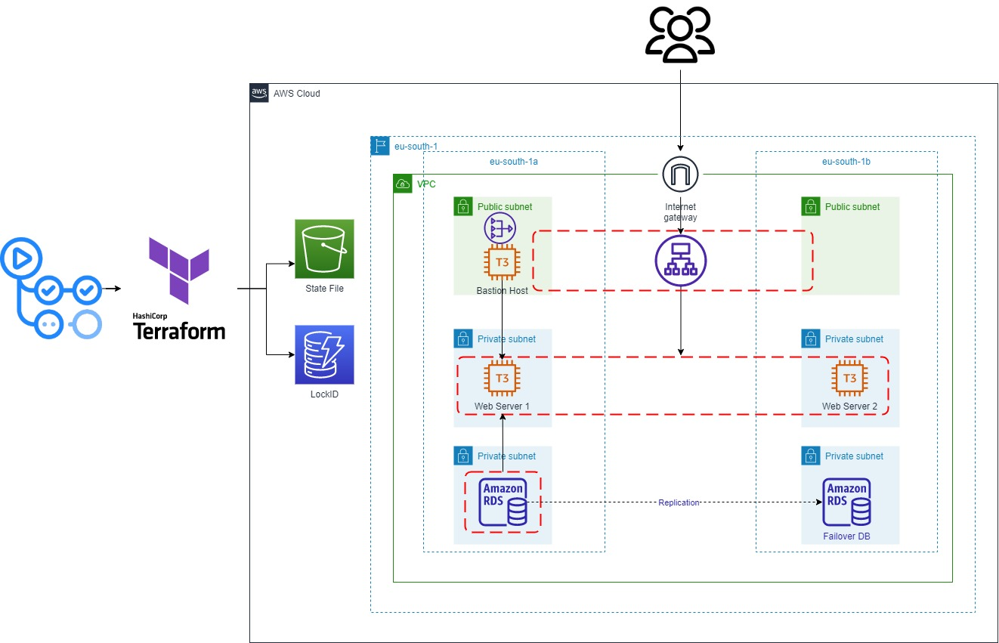

# Deploying AWS Webapp with Terraform and GitHub Actions (CI/CD) Pipeline

## Project Structure

## Project Description

- Deployed AWS Infrastructure using Terraform modules.
 - App running web application in 2 EC2 Instances behind Application Load Balancer.
 - One click or Trgger work flow to provision AWS infra and deployment.

## Technologies Used in Detail: 
1. **Terraform (IaC)**: To deploy AWS Infrastructure resources using Terraform modules.
2. **AWS Resources**:
	- VPC (2 Public Subnets, 4 Private Subnets, Elastic IP, Nat Gateway, Internet Gateway).
	- 3 EC2 Instances (two for hosting the app and bastion host to ssh), and Application Load Balancer.
	- RDS, and Elasticache.
	- S3 and Dynamodb: to store state file and lock it.
	- Security Groups.

3. **GitHub Actions (CI/CD) Pipeline**: To do these Jobs on every git push command, also manually triggered:
	- Automate the Infrastructure building and destroying process.
	- Provision the EC2 Instances and deploy application.

**Next Steps:**

	- Build, push docker image to ECR/Artifactory.
        - spin up AWS EKS infra using the AWS EKS module for terraform and integrate in workflow file.
	- Helm chart deployment
 terraform/
├── modules/
│   ├── network/
│   ├── database/
│   ├── compute/
│   └── ... (other reusable modules)
├── environments/
│   ├── dev/
│   ├── staging/
│   └── prod/
└── shared/
    ├── backend.tf
    └── provider.tf
4.  Monitoring and Logging

Access Token from Hashicrop Vault
Request the JWT from the GitHub OIDC provider, and present it to HashiCorp Vault to receive an access token:
You can use the hashicorp/vault-action action to fetch the JWT and receive the access token from Vault

CI/CD:

GitHub (Version Control) 
    |
    v
GitHub Actions (CI Pipeline)
    |
    v
Amazon ECR /Artifactory(Docker Image Registry)
    |
    v
Terraform (Provision AWS Infrastructure)
    |
    v
AWS EKS (Kubernetes Cluster)
    |
    v
Helm (Application Deployment)
    |
    v
Harness (Continuous Deployment/GitOps)
    |
    v
AWS Secrets Manager/HashiCorp Vault (Secrets Management)
    |
    v
Monitoring & Logging (Amazon CloudWatch, Prometheus, Grafana)
    |
    v
Performance Monitoring 
    |
    v
Security (AWS WAF, AWS Shield)
    |
    v
Notifications 
    |
    v
Backup & DR 

